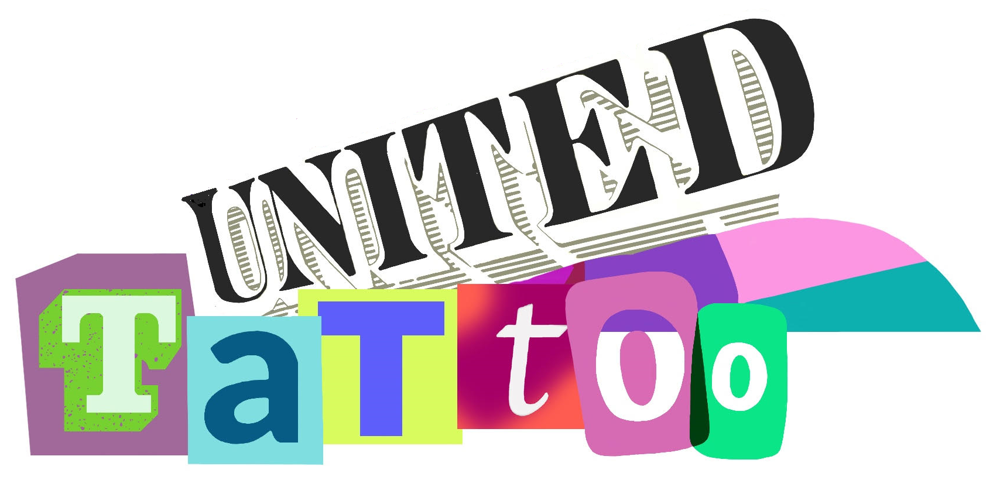
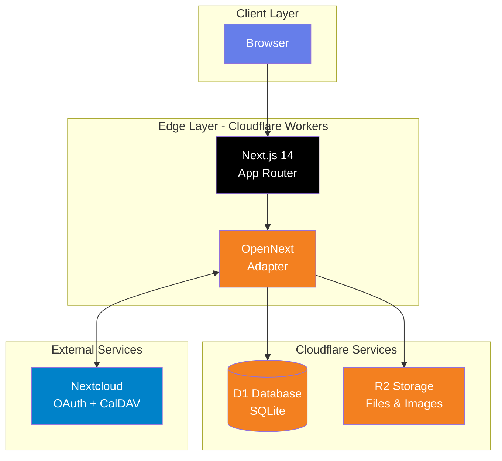

<div align="center">

<!-- DEPLOYMENT COMMAND -->
<div style="background: linear-gradient(135deg, #667eea 0%, #764ba2 100%); padding: 20px; border-radius: 10px; margin-bottom: 30px;">
  <h3 style="color: white; margin: 0;">DEPLOYMENT COMMAND</h3>
  <code style="color: #ffd700; font-size: 16px; font-weight: bold;">npm run pages:build && wrangler deploy</code>
</div>

<a id="readme-top"></a>

<!-- PROJECT SHIELDS -->
[![Contributors][contributors-shield]][contributors-url]
[![Issues][issues-shield]][issues-url]

<!-- PROJECT LOGO -->
<br />
<div align="center">
  <a href="https://git.biohazardvfx.com/nicholai/united-tattoo">
    
  </a>

  <h1 align="center" style="font-size: 48px; background: linear-gradient(135deg, #667eea 0%, #764ba2 100%); -webkit-background-clip: text; -webkit-text-fill-color: transparent;">United Tattoo</h1>

  <p align="center" style="font-size: 18px; max-width: 600px;">
    Official Website for United-Tattoo, built on Cloudflare's edge network.
    <br />
    <br />
    <a href="https://united-tattoos.com"><strong>View Live Site »</strong></a>
    <br />
    <br />
    <a href="#getting-started">Quick Start</a>
    ·
    <a href="https://git.biohazardvfx.com/nicholai/united-tattoo/issues/new?labels=bug">Report Bug</a>
    ·
    <a href="https://git.biohazardvfx.com/nicholai/united-tattoo/issues/new?labels=enhancement">Request Feature</a>
  </p>
</div>

---

<!-- TABLE OF CONTENTS -->
## Table of Contents

- [About The Project](#about-the-project)
  - [Key Features](#key-features)
- [Tech Stack](#tech-stack)
- [Architecture](#architecture) [Getting Started](#getting-started) [Prerequisites](#prerequisites)
  - [Installation](#installation)
  - [Environment Variables](#environment-variables)
- [Development](#development)
  - [Common Commands](#common-commands)
  - [Database Management](#database-management)
- [Deployment](#deployment)
- [Documentation](#documentation)
- [Roadmap](#roadmap)
- [Contributing](#contributing)
- [License](#license)
- [Contact](#contact)

---

</div>

## About The Project

<div align="center">
  
</div>

<br />

**United Tattoo** is an all-in-one tool built for [United Tattoo](https://united-tattoos.com), a tattoo studio in **Fountain, Colorado**. It brings together artist portfolios, appointment booking, a flash tattoo marketplace, and calendar sync, all running on Cloudflare for speed and reliability.

### Key Features

- Artist portfolios with Instagram links
- Simple artist pages and management
- Book appointments online
- Browse and book flash tattoo designs
- Nextcloud sync for calendars and user login
- Admin and artist dashboards
- File and image uploads

<p align="right">(<a href="#readme-top">back to top</a>)</p>

---

## Tech Stack

<div align="center">

### Core Framework
[![Next.js][nextjs-badge]][next-url]
[![React][react-badge]][react-url]
[![TypeScript][typescript-badge]][typescript-url]

### Cloudflare Infrastructure
[![Cloudflare Workers][cloudflare-badge]][cloudflare-url]
[![OpenNext][opennext-badge]][opennext-url]

### UI & Styling
[![ShadCN UI][shadcn-badge]][shadcn-url]
[![Tailwind CSS][tailwind-badge]][tailwind-url]
[![Framer Motion][framer-badge]][framer-url]

### Database & Storage
[![Cloudflare D1][d1-badge]][d1-url]
[![Cloudflare R2][r2-badge]][r2-url]

### Authentication & Integration
[![NextAuth.js][nextauth-badge]][nextauth-url]
[![CalDAV][caldav-badge]][caldav-url]

### Testing & Quality
[![Vitest][vitest-badge]][vitest-url]
[![ESLint][eslint-badge]][eslint-url]
[![Prettier][prettier-badge]][prettier-url]

</div>

<details>
<summary><strong>Dependencies</strong></summary>

- Next.js (App Router), React, TypeScript
- ShadCN UI (Radix UI), Framer Motion, Tailwind CSS, Lenis, next-themes
- React Query, Zod, React Hook Form
- CalDAV/Calendar: tsdav, react-big-calendar, ical.js, date-fns
- Image/file tools: Sharp, heic-convert, AWS SDK (R2)
- Testing: Vitest, React Testing Library

</details>

<p align="right">(<a href="#readme-top">back to top</a>)</p>

---

## Architecture

<div align="center">



</div>

### System Flow

<details>
<summary><strong>Authentication Flow</strong></summary>

```
User Request → NextAuth.js
    ↓
    ├─ Nextcloud OAuth (Primary)
    │   ├─ Check user groups (via OCS API)
    │   ├─ Assign role based on group
    │   │   ├─ "admins" → SUPER_ADMIN
    │   │   ├─ "shop_admins" → SHOP_ADMIN
    │   │   ├─ "artists" → ARTIST (auto-create profile)
    │   │   └─ Other → Deny access
    │   └─ Create/update user in D1
    │
    ├─ Credentials (Fallback - Admin Only)
    │   ├─ Query parameter: ?admin=true
    │   ├─ Email/password validation
    │   └─ Dev mode: Auto-create SUPER_ADMIN
    │
    └─ Session Created (JWT)
```

</details>

<details>
<summary><strong>CalDAV Sync Flow</strong></summary>

```
Appointment Created/Updated
    ↓
syncAppointmentToCalendar()
    ↓
    ├─ Get artist's Nextcloud calendar config
    ├─ Connect to CalDAV server
    ├─ Create/update VEVENT
    ├─ Store calendar_event_uid in D1
    └─ Log sync operation

Background Sync (Periodic)
    ↓
pullCalendarEventsToDatabase()
    ↓
    ├─ Fetch events from CalDAV
    ├─ Compare with D1 appointments
    ├─ Update changed appointments
    ├─ Import external events
    └─ Log sync results
```

</details>

<details>
<summary><strong>Database Schema</strong></summary>

**Core Tables:**

| Table | Description | Key Fields |
|-------|-------------|------------|
| `users` | Authentication & profiles | id, email, name, role, nextcloud_user_id |
| `artists` | Artist profiles | id, user_id, slug, bio, specialties (JSON), hourly_rate |
| `portfolio_images` | Artist work gallery | id, artist_id, image_url, tags (JSON), order, is_public |
| `flash_items` | Pre-drawn designs | id, artist_id, title, price, is_available |
| `appointments` | Booking system | id, artist_id, client_id, status, start_time, end_time, deposit |
| `availability` | Artist schedules | id, artist_id, day_of_week, start_time, end_time |
| `artist_calendars` | CalDAV configuration | id, artist_id, calendar_url, username, password |
| `calendar_sync_logs` | Sync monitoring | id, artist_id, operation, status, details |
| `site_settings` | Global config | key, value, type |
| `file_uploads` | R2 file tracking | id, user_id, file_url, file_size, mime_type |

**Indexes:** Optimized for artist lookups, appointment queries, and calendar sync operations.

</details>

### Project Structure

```
united-tattoo/
├── app/                      # Next.js App Router
│   ├── (public)/            # Public pages (no auth)
│   │   ├── artists/         # Artist profiles & portfolios
│   │   ├── book/            # Booking pages
│   │   └── page.tsx         # Homepage
│   ├── admin/               # Admin dashboard (SUPER_ADMIN, SHOP_ADMIN)
│   ├── artist-dashboard/    # Artist self-service (ARTIST)
│   ├── api/                 # API routes
│   │   ├── artists/         # Artist CRUD
│   │   ├── appointments/    # Booking endpoints
│   │   ├── caldav/          # Calendar sync
│   │   ├── flash/           # Flash items
│   │   └── upload/          # R2 file uploads
│   └── auth/                # NextAuth pages
├── lib/                     # Core logic
│   ├── db.ts               # D1 database functions
│   ├── auth.ts             # NextAuth config + helpers
│   ├── caldav-client.ts    # CalDAV integration
│   ├── calendar-sync.ts    # Sync logic
│   ├── nextcloud-client.ts # Nextcloud API client
│   ├── r2-upload.ts        # R2 file handling
│   └── env.ts              # Environment validation
├── components/              # React components
│   ├── ui/                 # ShadCN components
│   └── ...                 # Feature components
├── sql/                     # Database
│   ├── schema.sql          # Main schema
│   └── migrations/         # Migration files
├── docs/                    # Documentation
├── .gitea/workflows/       # CI/CD pipelines
└── wrangler.toml           # Cloudflare config
```

<p align="right">(<a href="#readme-top">back to top</a>)</p>

---

## Getting Started

### Prerequisites

<div style="background: #fff3cd; padding: 15px; border-left: 4px solid #ffc107; border-radius: 4px; margin: 20px 0;">
<strong>Required Accounts & Access</strong>

Before starting, ensure you have:
- **Cloudflare Account** with access to Workers, D1, R2, and Pages
- **Nextcloud Instance** with admin access for OAuth app creation
- **Node.js 18+** and npm installed
- **Wrangler CLI** version 3+
</div>

**Install Wrangler:**
```bash
npm install -g wrangler
```

**Cloudflare Resources Required:**
- **Workers & Pages**: For hosting the application
- **D1 Database**: SQLite database (named `united-tattoo`)
- **R2 Buckets**: File storage (`united-tattoo`, `united-tattoo-inc-cache`)

### Installation

1. **Clone the repository**
   ```bash
   git clone https://git.biohazardvfx.com/nicholai/united-tattoo.git
   cd united-tattoo
   ```

2. **Install dependencies**
   ```bash
   npm install
   ```

3. **Configure environment variables**
   ```bash
   cp .env.example .env.local
   # Edit .env.local with your credentials (see Environment Variables section)
   ```

4. **Set up Cloudflare D1 database**
   ```bash
   # Create D1 database (if not exists)
   wrangler d1 create united-tattoo

   # Apply schema to local D1
   npm run db:migrate:local

   # Apply schema to preview/production
   npm run db:migrate:latest:preview
   ```

5. **Configure Nextcloud OAuth**

   See [`docs/NEXTCLOUD-OAUTH-SETUP.md`](docs/NEXTCLOUD-OAUTH-SETUP.md) for detailed instructions on:
   - Creating OAuth application in Nextcloud
   - Configuring group-based role assignment
   - Setting up service account for CalDAV

6. **Run locally**
   ```bash
   # Next.js dev server (port 3000)
   npm run dev

   # OR with Cloudflare Workers simulation
   npm run dev:wrangler
   ```

7. **Access the application**
   - Local: `http://localhost:3000`
   - Sign in: `http://localhost:3000/auth/signin`
   - Admin signin: `http://localhost:3000/auth/signin?admin=true`

<p align="right">(<a href="#readme-top">back to top</a>)</p>

### Environment Variables

<details open>
<summary><strong>Required Variables</strong></summary>

| Variable | Description | Example |
|----------|-------------|---------|
| **Database** | | |
| `DATABASE_URL` | PostgreSQL URL (legacy, using D1 via bindings) | `postgresql://...` |
| `DIRECT_URL` | Direct database connection (optional) | `postgresql://...` |
| **Authentication** | | |
| `NEXTAUTH_URL` | Application URL | `https://united-tattoos.com` |
| `NEXTAUTH_SECRET` | NextAuth secret key | Generate with `openssl rand -base64 32` |
| **File Storage (Cloudflare R2)** | | |
| `AWS_ACCESS_KEY_ID` | R2 access key ID | From Cloudflare dashboard |
| `AWS_SECRET_ACCESS_KEY` | R2 secret access key | From Cloudflare dashboard |
| `AWS_REGION` | Region (any valid AWS region) | `us-east-1` |
| `AWS_BUCKET_NAME` | R2 bucket name | `united-tattoo` |
| `AWS_ENDPOINT_URL` | R2 endpoint URL | `https://<account-id>.r2.cloudflarestorage.com` |
| **Nextcloud OAuth** | | |
| `NEXTCLOUD_BASE_URL` | Nextcloud instance URL | `https://portal.united-tattoos.com` |
| `NEXTCLOUD_OAUTH_CLIENT_ID` | OAuth app client ID | From Nextcloud admin |
| `NEXTCLOUD_OAUTH_CLIENT_SECRET` | OAuth app client secret | From Nextcloud admin |
| `NEXTCLOUD_ARTISTS_GROUP` | Group name for artists | `artists` |
| `NEXTCLOUD_ADMINS_GROUP` | Group name for shop admins | `shop_admins` |

</details>

<details>
<summary><strong>Optional Variables</strong></summary>

| Variable | Description | Default |
|----------|-------------|---------|
| **CalDAV (Calendar Sync)** | | |
| `NEXTCLOUD_USERNAME` | Service account username | — |
| `NEXTCLOUD_PASSWORD` | Service account password/app password | — |
| `NEXTCLOUD_CALENDAR_BASE_PATH` | CalDAV base path | `/remote.php/dav/calendars` |
| **OAuth Providers (Deprecated)** | | |
| `GOOGLE_CLIENT_ID` | Google OAuth client ID | — |
| `GOOGLE_CLIENT_SECRET` | Google OAuth client secret | — |
| `GITHUB_CLIENT_ID` | GitHub OAuth client ID | — |
| `GITHUB_CLIENT_SECRET` | GitHub OAuth client secret | — |
| **Migration** | | |
| `MIGRATE_TOKEN` | Token for public migration endpoint | Generate random string |
| **Analytics** | | |
| `VERCEL_ANALYTICS_ID` | Vercel Analytics ID | — |

</details>

<div style="background: #d1ecf1; padding: 15px; border-left: 4px solid #0c5460; border-radius: 4px; margin: 20px 0;">
<strong>Pro Tip:</strong> Use <code>.env.local</code> for local development and configure production variables in Cloudflare dashboard under Settings → Environment Variables.
</div>

<p align="right">(<a href="#readme-top">back to top</a>)</p>

---

## Development

### Common Commands

<table>
<thead>
<tr>
<th>Command</th>
<th>Description</th>
</tr>
</thead>
<tbody>

<tr><td colspan="2"><strong>Development</strong></td></tr>
<tr>
  <td><code>npm run dev</code></td>
  <td>Start Next.js dev server (port 3000)</td>
</tr>
<tr>
  <td><code>npm run dev:wrangler</code></td>
  <td>Build and preview with OpenNext/Cloudflare</td>
</tr>

<tr><td colspan="2"><strong>Testing</strong></td></tr>
<tr>
  <td><code>npm run test</code></td>
  <td>Run Vitest in watch mode</td>
</tr>
<tr>
  <td><code>npm run test:ui</code></td>
  <td>Run Vitest with interactive UI</td>
</tr>
<tr>
  <td><code>npm run test:run</code></td>
  <td>Run tests once (CI mode)</td>
</tr>
<tr>
  <td><code>npm run test:coverage</code></td>
  <td>Run tests with coverage report</td>
</tr>

<tr><td colspan="2"><strong>Build & Deployment</strong></td></tr>
<tr>
  <td><code>npm run pages:build</code></td>
  <td>Build with OpenNext for Cloudflare</td>
</tr>
<tr>
  <td><code>npm run build</code></td>
  <td>Standard Next.js build (standalone)</td>
</tr>
<tr>
  <td><code>npm run preview</code></td>
  <td>Preview OpenNext build locally</td>
</tr>
<tr>
  <td><code>npm run deploy</code></td>
  <td>Deploy to Cloudflare Pages</td>
</tr>

<tr><td colspan="2"><strong>Code Quality</strong></td></tr>
<tr>
  <td><code>npm run ci:lint</code></td>
  <td>Run ESLint</td>
</tr>
<tr>
  <td><code>npm run ci:typecheck</code></td>
  <td>TypeScript type checking (noEmit)</td>
</tr>
<tr>
  <td><code>npm run ci:test</code></td>
  <td>Run tests with coverage (CI)</td>
</tr>
<tr>
  <td><code>npm run ci:build</code></td>
  <td>Build for production (CI)</td>
</tr>
<tr>
  <td><code>npm run ci:budgets</code></td>
  <td>Check bundle size budgets</td>
</tr>

<tr><td colspan="2"><strong>Formatting</strong></td></tr>
<tr>
  <td><code>npm run lint</code></td>
  <td>Run ESLint</td>
</tr>
<tr>
  <td><code>npm run format</code></td>
  <td>Format code with Prettier</td>
</tr>
<tr>
  <td><code>npm run format:check</code></td>
  <td>Check formatting without changing files</td>
</tr>

</tbody>
</table>

### Database Management

<details>
<summary><strong>Migration Commands</strong></summary>

**Local Database:**
```bash
# Apply schema to local D1
npm run db:migrate:local

# View tables in local D1
npm run db:studio:local

# Backup local database
npm run db:backup:local
```

**Preview Environment (default):**
```bash
# Apply schema to preview D1
npm run db:migrate

# Apply all migrations from sql/migrations/
npm run db:migrate:latest:preview

# View tables in preview D1
npm run db:studio

# Backup preview database
npm run db:backup
```

**Production Environment:**
```bash
# Apply specific migration to production
npm run db:migrate:up:prod

# Apply all migrations to production
npm run db:migrate:latest:prod
```

**Direct Wrangler Commands:**
```bash
# Execute SQL query on local D1
wrangler d1 execute united-tattoo --local --command="SELECT * FROM artists"

# Apply schema file
wrangler d1 execute united-tattoo --file=./sql/schema.sql

# Execute with preview (remote)
wrangler d1 execute united-tattoo --command="SELECT * FROM users"
```

</details>

<details>
<summary><strong>Creating New Migrations</strong></summary>

1. Create migration file in `sql/migrations/` with format:
   ```
   YYYYMMDD_NNNN_description.sql
   ```
   Example: `20250130_0001_add_flash_items_table.sql`

2. Write your SQL migration:
   ```sql
   -- Add flash_items table
   CREATE TABLE IF NOT EXISTS flash_items (
     id TEXT PRIMARY KEY,
     artist_id TEXT NOT NULL,
     title TEXT NOT NULL,
     price REAL NOT NULL,
     is_available INTEGER DEFAULT 1,
     created_at TEXT DEFAULT CURRENT_TIMESTAMP,
     FOREIGN KEY (artist_id) REFERENCES artists(id) ON DELETE CASCADE
   );
   ```

3. Test locally:
   ```bash
   npm run db:migrate:local
   ```

4. Apply to preview:
   ```bash
   npm run db:migrate:latest:preview
   ```

5. Apply to production (when ready):
   ```bash
   npm run db:migrate:latest:prod
   ```

</details>

<p align="right">(<a href="#readme-top">back to top</a>)</p>

---

## Deployment

**Production URL:** [https://united-tattoos.com](https://united-tattoos.com)

### Deployment Process

<div style="background: #f8d7da; padding: 15px; border-left: 4px solid #dc3545; border-radius: 4px; margin: 20px 0;">
<strong>Quick Deploy Command</strong><br><br>
<code>npm run pages:build && wrangler deploy</code>
</div>

**Step-by-Step:**

1. **Build with OpenNext**
   ```bash
   npm run pages:build
   ```
   This creates a Cloudflare-compatible build in `.vercel/output/static`

2. **Deploy to Cloudflare Pages**
   ```bash
   wrangler pages deploy .vercel/output/static
   ```

3. **Verify deployment**
   - Check Cloudflare dashboard: Workers & Pages → united-tattoo
   - Visit production URL: https://united-tattoos.com

### CI/CD Pipeline

The project uses **Gitea workflows** for automated CI/CD:

**Workflows:**
- **`ci.yaml`** - Main CI pipeline
  - ESLint
  - TypeScript type checking
  - Vitest tests with coverage
  - Production build
  - Bundle size budgets

- **`deploy.yaml`** - Automated deployments
  - Triggers on push to `main` branch
  - Builds and deploys to Cloudflare

- **`security.yaml`** - Security audits
  - npm audit
  - Dependency vulnerability scanning

- **`performance.yaml`** - Performance checks
  - Bundle size analysis
  - Preview smoke tests

**Bundle Size Budgets:**
- Total static assets: **3MB max**
- Individual assets: **1.5MB max**

Enforced by `scripts/budgets.mjs` in CI.

### Docker Support

<details>
<summary><strong>Docker Deployment (Alternative)</strong></summary>

The project includes a Dockerfile for self-hosting:

```bash
# Build image
docker build -t united-tattoo:latest .

# Run container
docker run --rm -p 3000:3000 \
  -e PORT=3000 \
  -e NEXTAUTH_URL=http://localhost:3000 \
  -e NEXTAUTH_SECRET=your-secret \
  # ... other env vars
  united-tattoo:latest
```

**Note:** Docker deployment bypasses Cloudflare Workers and uses Next.js standalone mode. For production, Cloudflare deployment is recommended.

</details>

<p align="right">(<a href="#readme-top">back to top</a>)</p>

---

## Documentation

Comprehensive documentation is available in the [`docs/`](docs/) directory:

### Key Documentation

| Document | Description |
|----------|-------------|
| [**NEXTCLOUD-OAUTH-SETUP.md**](docs/NEXTCLOUD-OAUTH-SETUP.md) | Complete guide to setting up Nextcloud OAuth and group-based authentication |
| [**CALDAV-SETUP.md**](docs/CALDAV-SETUP.md) | Instructions for configuring CalDAV calendar synchronization |
| [**CI-CD-PIPELINE.md**](docs/CI-CD-PIPELINE.md) | Detailed CI/CD pipeline documentation and troubleshooting |
| [**BOOKING-WORKFLOW-FINAL-PLAN.md**](docs/BOOKING-WORKFLOW-FINAL-PLAN.md) | Complete booking system architecture and workflow |

### Additional Documentation

<details>
<summary><strong>View All Documentation Files</strong></summary>

**Authentication & Integration:**
- [`CALDAV-IMPLEMENTATION-SUMMARY.md`](docs/CALDAV-IMPLEMENTATION-SUMMARY.md)
- [`NEXTCLOUD-OAUTH-SETUP.md`](docs/NEXTCLOUD-OAUTH-SETUP.md)

**Booking & Calendar:**
- [`BOOKING-WORKFLOW-FINAL-PLAN.md`](docs/BOOKING-WORKFLOW-FINAL-PLAN.md)
- [`BOOKING-WORKFLOW-REVISED-PLAN.md`](docs/BOOKING-WORKFLOW-REVISED-PLAN.md)
- [`BOOKING-WORKFLOW-RISKS.md`](docs/BOOKING-WORKFLOW-RISKS.md)
- [`CALDAV-SETUP.md`](docs/CALDAV-SETUP.md)

**CI/CD & DevOps:**
- [`CI-CD-PIPELINE.md`](docs/CI-CD-PIPELINE.md)
- [`CI-CD-QUICK-REFERENCE.md`](docs/CI-CD-QUICK-REFERENCE.md)

**Performance & SEO:**
- [`SEO-AND-PERFORMANCE-IMPROVEMENTS.md`](docs/SEO-AND-PERFORMANCE-IMPROVEMENTS.md)
- [`SEO-TESTING-GUIDE.md`](docs/SEO-TESTING-GUIDE.md)
- [`PERFORMANCE-SEO-SUMMARY.md`](docs/PERFORMANCE-SEO-SUMMARY.md)

**Project Management:**
- [`PROJECT-DOCUMENTATION.md`](docs/PROJECT-DOCUMENTATION.md)
- [`technical-decisions-template.md`](docs/technical-decisions-template.md)

</details>

### AI Development Guide

The project includes **[`CLAUDE.md`](CLAUDE.md)** with comprehensive instructions for AI assistants (like Claude Code) working with this codebase, including:
- Complete architecture overview
- Common commands reference
- Database layer patterns
- Authentication flows
- CalDAV integration details
- Development best practices

<p align="right">(<a href="#readme-top">back to top</a>)</p>

---

## Roadmap

### Completed Features

- [x] Artist portfolio system with galleries
- [x] Nextcloud OAuth with auto-provisioning
- [x] CalDAV bidirectional sync
- [x] Flash tattoo marketplace
- [x] Admin dashboard with analytics
- [x] Artist self-service dashboard
- [x] Appointment booking system
- [x] R2 file storage integration
- [x] Role-based access control
- [x] CI/CD pipeline with Gitea
- [x] Bundle size enforcement
- [x] HEIC image conversion
- [x] Artist slug-based URLs

### In Progress

- [ ] Email notifications for appointments
- [ ] SMS reminders for clients
- [ ] Advanced calendar conflict resolution
- [ ] Payment integration (Stripe/Square)
- [ ] Gift card system enhancements
- [ ] Enhanced analytics dashboard

### Future Enhancements

- [ ] Client self-service portal
- [ ] Online deposit payments
- [ ] Artist earnings reports
- [ ] Inventory management
- [ ] Social media auto-posting
- [ ] Mobile app (React Native)
- [ ] Webhook integrations
- [ ] Advanced reporting

See the [open issues](https://git.biohazardvfx.com/nicholai/united-tattoo/issues) for a full list of proposed features and known issues.

<p align="right">(<a href="#readme-top">back to top</a>)</p>

---

## Contributing

Contributions are welcome! This project follows standard Git workflows and conventional commits.

### Development Workflow

1. **Fork the project**
   ```bash
   # Via Gitea UI or git clone
   git clone https://git.biohazardvfx.com/nicholai/united-tattoo.git
   ```

2. **Create your feature branch**
   ```bash
   git checkout -b feat/amazing-feature
   ```

3. **Make your changes**
   - Follow existing code style (enforced by ESLint/Prettier)
   - Add tests for new features
   - Update documentation as needed

4. **Run quality checks**
   ```bash
   npm run lint              # Check linting
   npm run format            # Format code
   npm run ci:typecheck      # Check types
   npm run test:run          # Run tests
   npm run ci:budgets        # Check bundle sizes
   ```

5. **Commit your changes**
   ```bash
   git add .
   git commit -m "feat: add amazing feature"
   ```

   Use [Conventional Commits](https://www.conventionalcommits.org/) format:
   - `feat:` New feature
   - `fix:` Bug fix
   - `docs:` Documentation changes
   - `style:` Formatting, missing semicolons, etc.
   - `refactor:` Code refactoring
   - `test:` Adding tests
   - `chore:` Maintenance tasks

6. **Push to your branch**
   ```bash
   git push origin feat/amazing-feature
   ```

7. **Open a Pull Request**
   - Via Gitea UI
   - Provide clear description of changes
   - Reference any related issues

### Code Style Guidelines

- **TypeScript**: Prefer strict typing, avoid `any`
- **React**: Use functional components with hooks
- **File organization**: Keep components modular
- **Comments**: Explain "why", not "what"
- **Tests**: Test user-facing behavior, not implementation

### Top Contributors

<a href="https://git.biohazardvfx.com/nicholai/united-tattoo/graphs/contributors">
  
</a>

<p align="right">(<a href="#readme-top">back to top</a>)</p>

---

## License

<div style="background: #fff3cd; padding: 15px; border-left: 4px solid #ffc107; border-radius: 4px; margin: 20px 0;">
<strong>License Status</strong><br><br>
This project currently does not have a LICENSE file in the repository. If you intend to use GNU GPLv3 (as referenced in the original README template), please add a <code>LICENSE</code> or <code>COPYING</code> file with the full license text.<br><br>

Alternatively, consider:
- <strong>MIT License</strong> - Permissive, allows commercial use
- <strong>Apache 2.0</strong> - Permissive with patent grant
- <strong>GNU GPLv3</strong> - Copyleft, requires source disclosure
- <strong>Proprietary</strong> - All rights reserved

<a href="https://choosealicense.com">Choose A License</a> can help you decide.
</div>

**Current Status:** No license specified. Please add a LICENSE file to clarify usage terms.

<p align="right">(<a href="#readme-top">back to top</a>)</p>

---

## Contact

<div align="center">

**Nicholai Vogel**

[](https://nicholai.work)
[](https://linkedin.com/in/nicholai-vogel)
[](https://instagram.com/nicholai.exe)

**Project Repository**
[https://git.biohazardvfx.com/nicholai/united-tattoo](https://git.biohazardvfx.com/nicholai/united-tattoo)

**Live Website**
[https://united-tattoos.com](https://united-tattoos.com)

</div>

---

<div align="center">

### Star this repository if you find it helpful!

<p align="right">(<a href="#readme-top">back to top</a>)</p>

---

**Made with love for United Tattoo Studio, Fountain, CO**

</div>

<!-- MARKDOWN REFERENCE LINKS & BADGES -->
[contributors-shield]: https://img.shields.io/badge/Contributors-1-667eea?style=for-the-badge
[contributors-url]: https://git.biohazardvfx.com/nicholai/united-tattoo/graphs/contributors
[forks-shield]: https://img.shields.io/badge/Forks-0-667eea?style=for-the-badge
[forks-url]: https://git.biohazardvfx.com/nicholai/united-tattoo/network/members
[stars-shield]: https://img.shields.io/badge/Stars-0-667eea?style=for-the-badge
[stars-url]: https://git.biohazardvfx.com/nicholai/united-tattoo/stargazers
[issues-shield]: https://img.shields.io/badge/Issues-0-667eea?style=for-the-badge
[issues-url]: https://git.biohazardvfx.com/nicholai/united-tattoo/issues
[linkedin-shield]: https://img.shields.io/badge/-LinkedIn-black.svg?style=for-the-badge&logo=linkedin&colorB=0077B5
[linkedin-url]: https://linkedin.com/in/nicholai-vogel

[nextjs-badge]: https://img.shields.io/badge/Next.js_14-000000?style=for-the-badge&logo=nextdotjs&logoColor=white
[next-url]: https://nextjs.org/
[react-badge]: https://img.shields.io/badge/React_18-20232A?style=for-the-badge&logo=react&logoColor=61DAFB
[react-url]: https://react.dev/
[typescript-badge]: https://img.shields.io/badge/TypeScript-3178C6?style=for-the-badge&logo=typescript&logoColor=white
[typescript-url]: https://www.typescriptlang.org/
[cloudflare-badge]: https://img.shields.io/badge/Cloudflare_Workers-F38020?style=for-the-badge&logo=cloudflare&logoColor=white
[cloudflare-url]: https://developers.cloudflare.com/workers/
[opennext-badge]: https://img.shields.io/badge/OpenNext-18181B?style=for-the-badge&logo=vercel&logoColor=white
[opennext-url]: https://opennext.js.org/
[shadcn-badge]: https://img.shields.io/badge/ShadCN_UI-000000?style=for-the-badge&logo=shadcnui&logoColor=white
[shadcn-url]: https://ui.shadcn.com
[tailwind-badge]: https://img.shields.io/badge/Tailwind_CSS-38B2AC?style=for-the-badge&logo=tailwind-css&logoColor=white
[tailwind-url]: https://tailwindcss.com
[framer-badge]: https://img.shields.io/badge/Framer_Motion-0055FF?style=for-the-badge&logo=framer&logoColor=white
[framer-url]: https://www.framer.com/motion/
[d1-badge]: https://img.shields.io/badge/D1_Database-F38020?style=for-the-badge&logo=cloudflare&logoColor=white
[d1-url]: https://developers.cloudflare.com/d1/
[r2-badge]: https://img.shields.io/badge/R2_Storage-F38020?style=for-the-badge&logo=cloudflare&logoColor=white
[r2-url]: https://developers.cloudflare.com/r2/
[nextauth-badge]: https://img.shields.io/badge/NextAuth.js-000000?style=for-the-badge&logo=nextdotjs&logoColor=white
[nextauth-url]: https://next-auth.js.org/
[caldav-badge]: https://img.shields.io/badge/CalDAV-0082C9?style=for-the-badge&logo=nextcloud&logoColor=white
[caldav-url]: https://en.wikipedia.org/wiki/CalDAV
[vitest-badge]: https://img.shields.io/badge/Vitest-6E9F18?style=for-the-badge&logo=vitest&logoColor=white
[vitest-url]: https://vitest.dev/
[eslint-badge]: https://img.shields.io/badge/ESLint-4B32C3?style=for-the-badge&logo=eslint&logoColor=white
[eslint-url]: https://eslint.org/
[prettier-badge]: https://img.shields.io/badge/Prettier-F7B93E?style=for-the-badge&logo=prettier&logoColor=black
[prettier-url]: https://prettier.io/
