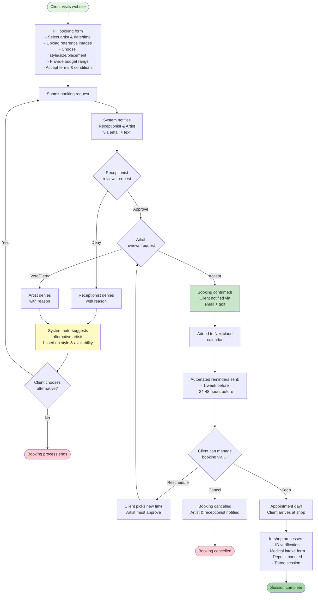

I had a discussion with Christy, we discussed the booking flows and design of the website.
We aligned on a booking flow, and I got her thinking about what she would like the United Brand to become:

She mentioned she likes these things (visually):

- Statue of liberty
- Hand on torch visualization
- Dove imagery (represents freedom)

Takeaways:

- The current business card design is something she really likes, however, the current
  brand language is also something she enjoys. So a combination of both would be good.
- incorporating a dove within the current design is important to Christy. The visual of a Dove being released is representative of her finding freedom from Kris.

Booking:

## Booking Flow Diagram

## Form Requirements

The form has a few must haves:

- Both artist and receptionist should be notified about the booking request
- User should be able to upload multiple reference images (inspiration, design ideas)
- User should be able to pick the style, size, placement, and budget range
- User must accept terms & conditions (includes age 18+ acknowledgment)
- System sends automated reminders before appointments

There's a few factors for how it should work:

1. A user should be able to go to the website and request a booking
2. When the user requests a booking, they have the ability to request a date and time, and are also given the option to select an alternative time.
   - The Calendar on the booking form is synchronized to Nextcloud, which is what the shop uses for their internal calendar management and appointment scheduling.
3. After this, the booking request is sent to both the reception desk and the artist, who are notified over email and text.
4. The artist and reception both have the option of accepting the booking, however the artist has the ability to vetoe over the receptionists.
   a. When a booking is accepted, the client is notified over text and email, and is able to manage their booking via a UI on the website.
   b. When the booking is denied, the client is notified over text and email, and they are given an alternative option of a different artist.
   - in edge cases where that person should be blacklisted, the client can be denied respectfully.

## Receptionist Approval Layer

The receptionist (or shop admin) acts as the first line of triage for booking requests:

- When a booking comes in, both receptionist and artist get notified
- Receptionist can review the request and either:
  - **Approve** - passes the booking to the artist for final approval
  - **Deny** - rejects the booking (with reason) and optionally suggests an alternative artist
- If receptionist approves, the artist then gets the final say:
  - **Artist accepts** - booking is confirmed, client gets notified
  - **Artist vetoes** - booking is denied even if receptionist approved it
- This two-step process helps filter out problematic requests before taking up artist time
- All approval/denial actions are logged with timestamps and reasons for record-keeping

## Alternative Artist Auto-Suggestion

When a booking is denied (either by receptionist or artist), the system can automatically suggest alternative artists:

- System looks at the requested tattoo style (e.g., traditional, realism, black & grey)
- Finds other artists who specialize in that style
- Checks their calendar availability for the requested time slot (or nearby slots)
- Presents 2-3 alternative artist suggestions to the client with:
  - Artist name and portfolio preview
  - Available time slots within the same week
  - One-click option to submit a new booking request with that artist
- If no artists match the style or availability, client is given a general "contact us" option
- Receptionist can also manually override the auto-suggestions if they know a better fit

## Automated Reminders

To reduce no-shows and keep clients informed, the system sends automatic reminders:

- **1 week before**: "Your appointment with [Artist] is coming up on [Date] at [Time]"
- **24-48 hours before**: "Reminder: Your appointment is tomorrow. Please arrive 10 minutes early. Reply CANCEL if you need to reschedule."
- Reminders sent via both email and text (if phone number provided)
- Include preparation instructions (what to eat, avoid alcohol, etc.)
- Include cancellation/rescheduling link

## Cancellation & Rescheduling

Clients can cancel or reschedule through their booking management UI:

- **Reschedule**: Client picks a new time from artist's available slots, artist must approve the change
- **Cancel**: Client cancels the appointment, artist and receptionist get notified
- Deposit policy (if applicable) is handled in-shop, not enforced by the website
- Artist can also cancel/reschedule from their dashboard (illness, emergency, etc.)

## Out of Scope (Handled In-Shop)

These items are intentionally NOT part of the online booking system to keep it simple and maintainable:

- **Deposits/Payments**: Handled in person or over the phone per artist preference
- **Medical information**: Collected on paper intake forms in-shop with ID verification
- **Age verification with ID**: Terms & conditions acknowledgment online, ID check happens in-shop
- **Client-artist design communication**: Artists use their preferred channels (text, email, Instagram DM)
- **Multi-session booking**: Book first session online, subsequent sessions booked in person after session 1
