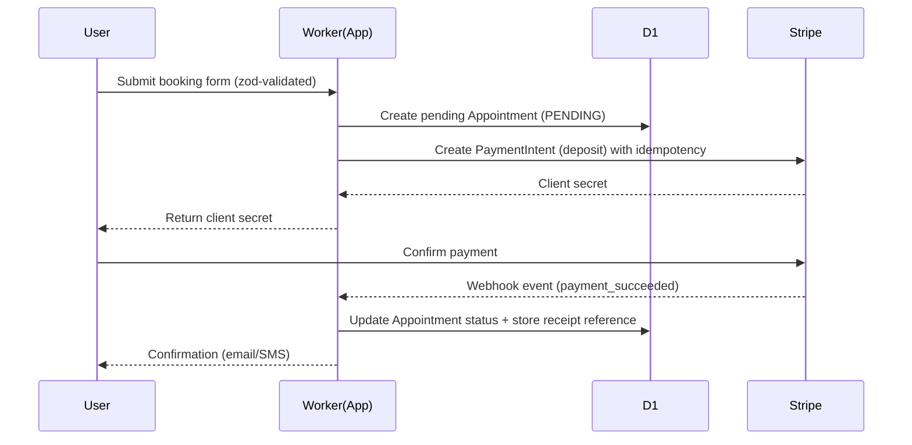
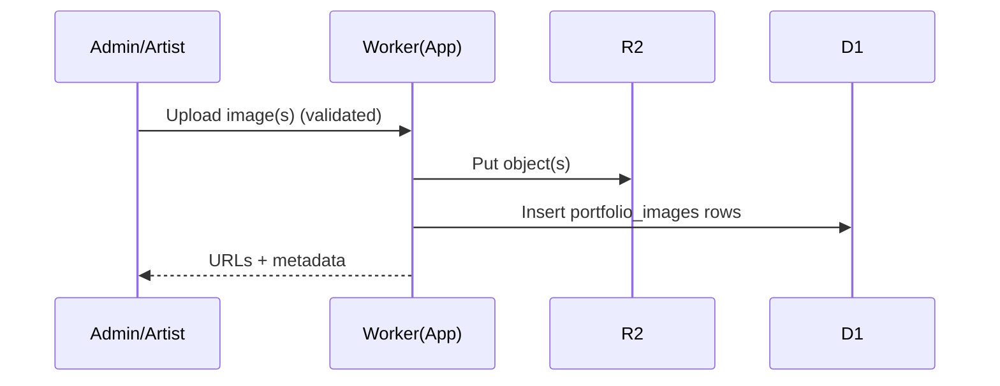

# United Tattoo – Fullstack Architecture Document

Version: 1.0  
Date: 2025-09-17  
Output Template: .bmad-core/templates/architecture-tmpl.yaml (architecture-template-v2)  
Basis: docs/PRD.md, repo config (wrangler.toml, open-next.config.ts, next.config.mjs, package.json), lib/*, sql/schema.sql

Introduction

This document outlines the complete fullstack architecture for United Tattoo, including backend systems, frontend implementation, and their integration. It serves as the single source of truth for AI-driven development, ensuring consistency across the entire technology stack.

This unified approach combines what would traditionally be separate backend and frontend architecture documents, streamlining the development process for modern fullstack applications where these concerns are increasingly intertwined.

Starter Template or Existing Project

Decision: Existing project (this repository) on Next.js App Router with OpenNext for Cloudflare.
- Pre-configured stack: Next 14.2.16, Tailwind, ShadCN, OpenNext Cloudflare adapter, Wrangler, Vitest.
- Structure: app/ routes, components/, lib/, sql/, etc.
- Built-in patterns: SSR with App Router, route handlers under app/api, middleware guards, Zod validations, D1/R2 bindings.
- Constraints: Cloudflare Workers runtime; D1 (SQLite semantics), R2 for media and ISR cache. Images unoptimized (Next images disabled by config).
Change Log

| Date       | Version | Description                                 | Author   |
|------------|---------|---------------------------------------------|----------|
| 2025-09-17 | 1.0     | Initial fullstack architecture document     | Architect |

High Level Architecture

Technical Summary

United Tattoo runs as a serverless, modular monolith on Cloudflare Pages + Workers using the OpenNext adapter. Next.js App Router handles SSR/ISR and routing; Cloudflare D1 stores structured data (users, artists, appointments, settings) and R2 stores media plus incremental cache. The fullstack architecture implements both frontend UI components and backend services (auth, RBAC, validations, uploads, booking, payments, notifications, calendar sync) via Next.js route handlers, server actions, and React components with strict Zod validation and middleware-based RBAC. The architecture prioritizes image-forward delivery performance, reliability, and maintainability aligned to the PRD.

High Level Overview

1) Style: Serverless modular monolith (single app, bounded modules by domain).
2) Repo: Single repository (this project).
3) Services: Single deployable (OpenNext worker) with internal modules (auth, artists, portfolio, booking, payments, notifications, calendar).
4) Primary flows:
   - Public SSR pages, search/discovery (later), booking/consultation routing, client portal (later).
   - Admin onboarding, artist/portfolio CRUD, uploads to R2, moderation queue (later), activity logs (later).
   - Payments via Stripe for deposits; later add PayPal.
   - Two-way Google Calendar sync for artists (planned now).
5) Key decisions:
   - Cloudflare-first stack (D1, R2, Pages/Workers) with OpenNext.
   - REST via route handlers + Server Actions for same-origin mutations.
   - Zod across edges; strict RBAC via middleware.
   - Sentry + OpenTelemetry for observability; Upstash Redis for rate limiting.

High Level Project Diagram

```mermaid
graph TD
  subgraph Users
    V[Visitor]
    C[Client]
    A[Admin/Artist]
  end

  V -->|HTTP(S)| CDN[Cloudflare CDN]
  C -->|HTTP(S)| CDN
  A -->|HTTP(S)| CDN

  CDN --> W[OpenNext Worker (Next.js App)]
  W --> D1[(Cloudflare D1)]
  W --> R2[(Cloudflare R2 - Media)]
  W --> R2INC[(R2 - ISR/Incremental Cache)]

  W --> STRIPE[Stripe API]
  W --> RESEND[Resend Email]
  W --> TWILIO[Twilio SMS]
  W --> GCAL[Google Calendar API]

  style W fill:#222,stroke:#999,color:#fff
  style D1 fill:#114,stroke:#99f,color:#fff
  style R2 fill:#141,stroke:#9f9,color:#fff
  style R2INC fill:#141,stroke:#9f9,color:#fff,stroke-dasharray: 5 5
```

Architectural and Design Patterns

- Serverless Modular Monolith (chosen): Single worker with domain modules. Rationale: Simpler ops, Cloudflare-native, low latency, satisfies PRD scope; avoids premature microservices.
- Communication: RESTful route handlers + Server Actions. Alternative: GraphQL (deferred). Rationale: Simplicity, aligns with Next App Router, easy cache/policy control.
- Data Access: Thin repository-like helpers (lib/db.ts) with prepared SQL on D1. Alternative: Kysely/Prisma (N/A on Workers) → stay with direct SQL for D1. Rationale: Control, performance, D1 fit.
- Validation: Zod at boundaries (API/server actions/forms). Rationale: Single schema source; consistent erroring.
- AuthZ: Middleware-based RBAC on path prefixes + helper functions. Rationale: Centralized enforcement.
- Caching: R2-based ISR via OpenNext override; CDN caching for assets/API where applicable. Rationale: Cost/perf balance.
- Rate limiting: Redis (Upstash). Alternative: KV tokens. Rationale: Simplicity and global availability.

Tech Stack

Cloud Infrastructure
- Provider: Cloudflare
- Key Services: Pages + Workers (OpenNext), D1 (SQL), R2 (object storage + ISR cache)
- Regions: Global edge (Cloudflare network), D1 region as configured by account

Technology Stack Table

| Category         | Technology                      | Version                 | Purpose                                      | Rationale                                        |
|------------------|---------------------------------|-------------------------|----------------------------------------------|--------------------------------------------------|
| Language         | TypeScript                      | 5.x (lockfile-resolved) | Primary backend language                     | Strong typing, tooling, Next.js alignment        |
| Framework        | Next.js (App Router)            | 14.2.16                 | SSR/ISR, routing, APIs, server actions       | Matches UI, supports OpenNext                    |
| Platform         | OpenNext (Cloudflare)           | ^1.8.2 (lockfile pin)   | Next->Workers build, ISR in R2               | Official adapter, ISR override support           |
| Runtime          | Cloudflare Workers              | nodejs_compat enabled   | Serverless execution                         | Edge-native, low latency                         |
| Config/Deploy    | Wrangler                        | ^4.37.1 (pin in lock)   | Build/preview/deploy worker + bindings       | Cloudflare-native tooling                        |
| DB               | Cloudflare D1                   | Managed                 | Relational store for core data               | Simple, sufficient for scope, low-ops            |
| Storage          | Cloudflare R2                   | Managed                 | Media assets; ISR cache bucket               | Cost-effective, global access                    |
| Auth             | NextAuth (Auth.js)              | ^4.24.11 (pin in lock)  | JWT sessions + providers                     | Standard pattern with Next                       |
| Validation       | Zod                             | 3.25.67                 | Input/env validation                         | Ubiquitous + types inference                     |
| Testing          | Vitest + RTL                    | ^3.2.4 + latest RTL     | Unit/component testing                       | Fast, TS-native                                  |
| Observability    | Sentry + OpenTelemetry          | Latest stable           | Errors, traces, metrics                      | Full visibility across Workers + Next            |
| Rate Limiting    | Upstash Redis                   | Managed                 | Rate limit auth/forms/APIs                   | Simplicity, global                               |
| Payments         | Stripe (primary); PayPal later  | Latest SDK              | Deposits, refunds                            | Start with Stripe per customization              |
| Email            | Resend                          | Latest SDK              | Transactional emails                         | Simple, modern API                               |
| SMS              | Twilio                          | Latest SDK              | Notifications (reminders, etc.)              | Reliable, well-documented                        |
| Calendar         | Google Calendar API             | v3                      | Two-way artist sync                          | Per customization → implement now                |

Note: Exact semver pins should be recorded from the lockfile in CI. Next 14.2.16 and zod 3.25.67 are exact; others are resolved via lock.

Data Models

Core entities mapped from PRD and schema:
- User: id, email, name, role (CLIENT|ARTIST|SHOP_ADMIN|SUPER_ADMIN), avatar.
- Artist: id, userId, name, bio, specialties[], instagramHandle, isActive, hourlyRate.
- PortfolioImage: id, artistId, url, caption, tags[], orderIndex, isPublic, createdAt.
- Appointment: id, artistId, clientId, title, description, startTime, endTime, status, depositAmount, totalAmount, notes.
- Availability: id, artistId, dayOfWeek, startTime, endTime, isActive.
- SiteSettings: id, studioName, description, address, phone, email, socialMedia{}, businessHours[], heroImage, logoUrl.
- FileUpload: id, filename, originalName, mimeType, size, url, uploadedBy.

Relationships:
- User 1‑to‑1/0‑1 Artist (user_id).
- Artist 1‑to‑many PortfolioImage.
- User (client) 1‑to‑many Appointment; Artist 1‑to‑many Appointment.
- Artist 1‑to‑many Availability.

Components

- Auth & RBAC
  - Responsibility: JWT sessions; role enforcement.
  - Interfaces: /auth routes (NextAuth), middleware guards, helpers isAdmin/hasRole.
  - Dependencies: NextAuth, middleware.ts.
  - Tech: NextAuth with Credentials (dev), Google/GitHub optional.

- Artist & Portfolio Service
  - Responsibility: CRUD artists, portfolio images, ordering, visibility.
  - Interfaces: app/api/artists/*, app/api/portfolio/*, server actions for admin UI.
  - Dependencies: D1 tables, R2 uploads.
  - Tech: lib/db.ts helpers; lib/r2-upload.ts.

- Upload Service
  - Responsibility: R2 uploads (single/bulk), file validation, delete.
  - Interfaces: app/api/upload, admin UI dropzones.
  - Tech: R2 bucket binding; R2_PUBLIC_URL used to compose public URLs.

- Booking & Scheduling
  - Responsibility: Booking/consultation routing, appointment CRUD, availability.
  - Interfaces: app/api/appointments/*; server actions for stepper.
  - Dependencies: D1, Notifications, Stripe.
  - Tech: Zod forms; quote estimation (to be implemented).

- Payments
  - Responsibility: Deposit intents (Stripe), receipts, refunds; PayPal later.
  - Interfaces: app/api/payments/* webhooks; server actions for checkout init.
  - Dependencies: Stripe SDK, D1 to persist intents/receipts.
  - Tech: Stripe Checkout/PaymentIntents; signed webhooks; idempotency keys.

- Notifications
  - Responsibility: Email (Resend) + SMS (Twilio), templates, preferences.
  - Interfaces: internal functions invoked from flows; background execution pattern if needed.
  - Dependencies: D1 preferences, external providers.

- Calendar Integration
  - Responsibility: Google Calendar two-way sync for artists (now).
  - Interfaces: OAuth connect, webhook/push, polling fallback, reconciliation.
  - Dependencies: Google API, D1 for tokens, Appointments.

Component Diagram

```mermaid
graph LR
  AUTH[Auth & RBAC] --> API[Route Handlers / Server Actions]
  ART[Artists/Portfolio] --> API
  UP[Upload Service] --> API
  BK[Booking/Scheduling] --> API
  PAY[Payments (Stripe)] --> API
  NOTIF[Notifications] --> API
  CAL[Calendar Sync] --> API

  API --> D1[(D1)]
  API --> R2[(R2)]
  PAY --> STRIPE[Stripe]
  NOTIF --> RESEND[Resend]
  NOTIF --> TWILIO[Twilio]
  CAL --> GCAL[Google Calendar]
```

External APIs

- Stripe API
  - Purpose: Deposits, refunds; store payment intents + receipts.
  - Auth: API keys (Wrangler secret); webhook signing secret.
  - Rate limits: Stripe-managed; implement retries with backoff; idempotency keys.
  - Endpoints: PaymentIntents, Checkout, Refunds, Webhooks.

- Resend
  - Purpose: Transactional emails (booking confirmations, receipts).
  - Auth: API key (secret).
  - Integration: templated emails, error handling.

- Twilio
  - Purpose: SMS notifications (confirmations/reminders).
  - Auth: Account SID/Token (secret).
  - Rate limits: provider-specific; implement basic backoff.

- Google Calendar v3
  - Purpose: Two-way artist sync (now).
  - Auth: OAuth 2.0 per artist; token storage in D1; refresh handling.
  - Endpoints: Events, Watch (push), Channels (stop), CalendarList.

Core Workflows

Booking with Deposit (sequence)



Portfolio Upload (sequence)



REST API Spec (sketch)

openapi: 3.0.0
info:
  title: United Tattoo Backend API
  version: 1.0.0
  description: REST endpoints backing booking, admin, and integrations
servers:
  - url: https://your-preview-domain.pages.dev
    description: Preview
  - url: https://your-domain.com
    description: Production
paths:
  /api/appointments:
    get:
      summary: List appointments
    post:
      summary: Create appointment (server action preferred)
  /api/portfolio:
    post:
      summary: Upload portfolio image (server action preferred)
  /api/payments/deposit-intent:
    post:
      summary: Create Stripe PaymentIntent for deposit
  /api/webhooks/stripe:
    post:
      summary: Stripe webhook receiver

Database Schema

- Source of truth: sql/schema.sql (D1). Entities and indexes already implemented.
- Note: Fix comment header mismatch (“united-tattoo-db” vs scripts using “united-tattoo”).
- Migrations: wrangler d1 execute … --file=./sql/schema.sql (local/prod variants).

Source Tree

```
project-root/
├─ app/                       # App Router (public pages, admin area, api/)
│  ├─ api/                    # Route handlers
│  ├─ admin/                  # Admin UI sections
│  └─ ...                     # Site pages
├─ components/                # UI + composed components
├─ lib/
│  ├─ db.ts                   # D1 & R2 binding access + helpers
│  ├─ r2-upload.ts            # R2 upload manager
│  ├─ auth.ts                 # NextAuth config + RBAC helpers
│  ├─ env.ts                  # Zod env validation (see alignment note)
│  └─ validations.ts          # Zod schemas for domain + forms
├─ sql/
│  └─ schema.sql              # D1 schema SSoT
├─ wrangler.toml              # Worker config + bindings
├─ open-next.config.ts        # ISR cache override to R2
├─ next.config.mjs            # Next config (standalone, images unoptimized)
└─ package.json               # Scripts (build/preview/deploy/db/test)
```

Infrastructure and Deployment

Infrastructure as Code
- Tool: Wrangler 4.x
- Location: wrangler.toml
- Approach: Wrangler-only “config of record” now; Terraform later if needed.

Deployment Strategy
- Strategy: OpenNext build → Cloudflare Pages (Worker + assets).
- CI/CD Platform: Gitea (planned) with required pipeline gates.
- Pipeline Config: .gitea/workflows/* (to be added) or equivalent CI config.

Environments
- dev: Local dev server (next dev) and/or Workers preview (OpenNext preview).
- preview: Cloudflare Pages preview (pull requests).
- production: Cloudflare Pages live.

Environment Promotion Flow

```
feature → PR → CF Pages preview → E2E/quality gates → merge → production deploy
```

Rollback Strategy
- Primary Method: Re-deploy previous artifact via CF Pages rollback / previous commit.
- Triggers: Elevated errors, failed SLOs, payment or booking failures.
- RTO: < 30 minutes for deploy rollback; data roll-forward with compensating ops.

Error Handling Strategy

General Approach
- Error Model: Domain errors (validation, auth, business) vs operational (transient, provider).
- Propagation: Translate to typed JSON errors at API boundary; avoid leaking internals.

Logging Standards
- Library: Console structured JSON (Workers) + Sentry/Otel exporters.
- Format: JSON with fields: timestamp, level, correlationId, route, userId (if any).
- Levels: debug/info/warn/error; No PII in logs.

Error Handling Patterns
- External API Errors:
  - Retry: Exponential backoff (bounded), idempotency keys (Stripe).
  - Circuit Breaker: Soft disable non-critical providers on repeated failures.
  - Timeouts: Tight timeouts; fail fast, surface friendly errors.
- Business Logic Errors:
  - Custom error types; map to 4xx with helpful messages; do not expose details.
- Data Consistency:
  - D1 is transactional per statement; use idempotency on effects; write-ahead logic for webhooks.

Coding Standards (Backend)

Core Standards
- Languages & Runtimes: TypeScript (Workers-compatible), Next.js App Router.
- Style & Linting: ESLint + Prettier (enable in CI, even if build ignores failures).
- Tests: Vitest for unit; RTL for component; Playwright for e2e (planned).

Critical Rules
- Validate all external inputs with Zod at API boundary.
- Use lib/db.ts helpers; do not inline raw env binding plucking in routes.
- Payments: Always use idempotency keys for Stripe and verify signed webhooks.
- No secrets in logs; use Wrangler secrets for all provider keys.
- RBAC: All /admin and /api/admin routes must enforce SHOP_ADMIN or SUPER_ADMIN.
- Rate limiting must wrap auth/forms/API entrypoints once Upstash is configured.

Test Strategy and Standards

Testing Philosophy
- Approach: Pragmatic test-after with critical flows prioritized; expand coverage over time.
- Coverage Goals: Unit 60–70% rising; critical domain paths higher.

Test Types and Organization
- Unit: Vitest; files *.test.ts under __tests__/ or next to modules.
- Integration: D1 local (wrangler d1 execute) for repository tests; mock providers.
- E2E: Playwright on CF Pages preview (booking flow, uploads, admin critical).

Test Data Management
- Fixtures: __tests__/fixtures; factories for domain objects.
- Cleanup: Explicit clean after each suite (D1 truncate helpers for local env).

Continuous Testing
- CI Integration: Lint/typecheck → unit → build → migration dry-run → e2e on preview.

Security

Input Validation
- Library: Zod
- Location: Route handlers/server actions before processing
- Required Rules:
  - Validate all inputs (query/body/params).
  - Whitelist approach; reject extras.

Authentication & Authorization
- Auth Method: NextAuth JWT (Credentials for dev; OAuth optional).
- Session: JWT; role included in token; maxAge defaults; future 2FA.
- Required:
  - Enforce RBAC in middleware + route-level checks for admin endpoints.
  - Implement invites and 2FA per PRD in admin flows.

Secrets Management
- Development: Wrangler secrets; .env only for local dev of non-secrets.
- Production: Wrangler secrets; never commit secrets.
- Code Rules: Never log secrets; never embed keys.

API Security
- Rate Limiting: Upstash Redis (global) on auth/forms/APIs.
- CORS: Strict same-origin for server actions; minimal cross-origin where necessary.
- Security Headers: Enforce via centralized headers helper (CSP, X-Frame-Options DENY, Referrer-Policy strict-origin-when-cross-origin, Permissions-Policy).

Data Protection
- At Rest: Provider-managed (D1/R2). Encrypt sensitive app-level data if needed before storage.
- In Transit: HTTPS only.
- PII: Store minimal; redact logs.

Dependency Security
- Scanner: Enable dep audit in CI; weekly review cadence.
- New Deps: Require review; follow Context7 MCP check (per repo rules).

Security Testing
- SAST: ESLint/security rules; consider additional scanners.
- DAST: E2E includes basic auth + booking hardening; expand later.

Backend Customization Choices (Confirmed)

- Payments: Stripe first (PayPal later).
- Email: Resend.
- SMS: Twilio.
- Rate Limiting: Upstash Redis.
- Observability: Sentry + OpenTelemetry.
- Calendar Integration: Google two‑way sync now.
- API Style: Next.js Route Handlers (REST) + Server Actions.
- IaC/Config: Wrangler-only config of record (Terraform later).
- Env/Secrets: Align env.ts to Cloudflare bindings (remove unused AWS_* + DATABASE_URL now). Note: the current names in env.ts are labeled AWS_ but map to Cloudflare R2 usage—document and align.
- Security Headers: Centralized middleware/edge headers helper.

Next Steps

## Frontend Component Architecture

### Component Organization

- **App Router Structure**: Next.js App Router with layout hierarchy
  - Root layout: `app/layout.tsx` - Global providers, fonts, metadata
  - Client layout: `app/ClientLayout.tsx` - Main site navigation, footer
  - Admin layout: `app/admin/layout.tsx` - Admin dashboard structure
  - Nested layouts per section (artists, booking, etc.)

- **UI Components**: ShadCN-based component library with custom extensions
  - Base components: `components/ui/` - Button, Card, Input, Dialog, etc.
  - Domain components: `components/admin/`, `components/booking/`, etc.
  - Layout components: Navigation, Footer, Section wrappers
  - Form components: Booking forms, contact forms, payment forms

- **State Management**: React hooks + Zustand for global state
  - Local state: useState/useReducer for component-specific state
  - Form state: React Hook Form with Zod validation integration
  - Global state: Zustand stores for auth, booking, UI preferences
  - Server state: React Query for data fetching and caching

### Payment Form Components

**Stripe Embedded Elements Integration**:
- Payment form: `components/payment/StripePaymentForm.tsx`
- Card element: Stripe CardElement with custom styling
- Mobile optimization: Responsive design for 70% mobile usage
- Error handling: Validation errors and payment status feedback
- Loading states: Processing indicators and success confirmation

**Deposit Payment Flow**:
1. Booking form completion with service selection
2. Deposit amount calculation based on service pricing
3. Stripe PaymentIntent creation via server action
4. Embedded payment form rendering with client secret
5. Payment confirmation and status updates

### State Management for Payment Processing

- **Payment State Machine**:
  - `IDLE` → Initial state
  - `PROCESSING` → Payment submission
  - `SUCCESS` → Payment completed
  - `ERROR` → Payment failed
  - `CANCELLED` → User cancelled

- **Error Recovery**:
  - Retry mechanism for failed payments
  - Clear error messages with actionable steps
  - Session preservation during payment flow

### Mobile Optimization (70% Mobile Usage)

- **Responsive Design Principles**:
  - Mobile-first CSS approach
  - Touch-friendly interfaces (44px+ touch targets)
  - Simplified navigation for mobile
  - Optimized image loading and performance

- **Mobile-Specific Components**:
  - Mobile booking bar: `components/MobileBookingBar.tsx`
  - Touch-optimized forms and buttons
  - Swipeable carousels for artist portfolios
  - Simplified payment flow for mobile devices

### Error Handling and User Feedback

- **Frontend Error Boundaries**:
  - Global error boundary for uncaught exceptions
  - Component-level error handling
  - Graceful degradation for failed features

- **User Feedback Patterns**:
  - Toast notifications: `hooks/use-toast.ts`
  - Loading spinners and skeletons
  - Success/error modals for critical actions
  - Form validation feedback with Zod integration

## Testing Strategy (Frontend)

### Component Testing
- **Unit Tests**: Vitest + React Testing Library
  - Component rendering and interaction tests
  - Hook testing for custom React hooks
  - Form validation and state management tests

- **Integration Tests**:
  - Component composition testing
  - Form submission and validation flows
  - Payment form integration with mock Stripe

### E2E Testing
- **Playwright Tests**:
  - Booking flow from start to payment completion
  - Admin dashboard functionality
  - Mobile responsiveness testing
  - Cross-browser compatibility

### Payment Testing
- **Stripe Test Mode**:
  - Test card numbers for various scenarios
  - Webhook testing with local tunnel
  - Error scenario simulation
  - Mobile payment flow testing

## Next Steps

- Product Owner Review: Validate scope and sequencing (Phases 1–4).
- Dev Agent: Implement stories for Phase 1 (Admin invites, onboarding wizard stub, artist CRUD/portfolio upload MVP, D1/R2 confirmations).
- DevOps: Add CI pipeline, lock exact versions from lockfile into doc, add .env.example listing required secrets (NEXTAUTH_URL, NEXTAUTH_SECRET, R2_PUBLIC_URL, STRIPE_KEYS, RESEND_API_KEY, TWILIO_KEYS, GOOGLE_OAUTH, UPSTASH).

Appendix

Bindings (wrangler.toml)
- DB (D1), R2_BUCKET (media), NEXT_INC_CACHE_R2_BUCKET (ISR cache), WORKER_SELF_REFERENCE (service binding).

Runbooks
- Preview: npm run pages:build && npm run preview
- Deploy: npm run pages:build && npm run deploy
- DB: npm run db:create; npm run db:migrate[:local]

References
- PRD: docs/PRD.md
- Schema: sql/schema.sql
- Config: wrangler.toml, open-next.config.ts, next.config.mjs
